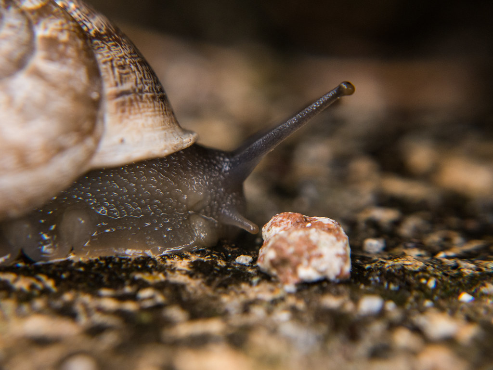

## Hejsan, detta är väldigt mycket av ett test

# *La texte ici est en francais. Je suis désolé si tu ne sais pas francais, mais si tu sais francais, c'est super! Je vais écrirer ici quelle famille j'ai eu. J'ai une mére, un pére et deaux fréres et soeurs. J'aime les bananes, mais je n'aime pas jouer au foot.*

# Voilà, et toi? Que'est-ce que tu aimes? Tu aimes les escargots? Tu aimes l'école? Je croix que tu aimes l'école. Tu peux aimes l'école. Je peux aussi que tu aimes aller nager à la plage. Tes oureilles est trés grand - c'est ne vrai pas.